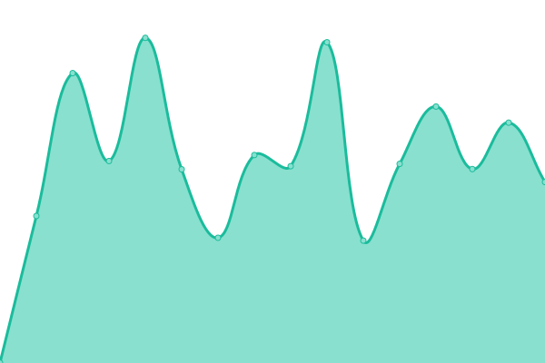

# [📈 Live Status](https://hiway-media.github.io): <!--live status--> **🟧 Partial outage**

This repository contains the open-source uptime monitor and status page for [Hiway Media](hiway.media), powered by [Upptime](https://github.com/upptime/upptime).

With [Upptime](https://upptime.js.org), you can get your own unlimited and free uptime monitor and status page, powered entirely by a GitHub repository. We use [Issues](https://github.com/HiWay-Media/status-check/issues) as incident reports, [Actions](https://github.com/HiWay-Media/status-check/actions) as uptime monitors, and [Pages](https://hiway-media.github.io) for the status page.

<!--start: status pages-->
<!-- This summary is generated by Upptime (https://github.com/upptime/upptime) -->
<!-- Do not edit this manually, your changes will be overwritten -->
<!-- prettier-ignore -->
| URL | Status | History | Response Time | Uptime |
| --- | ------ | ------- | ------------- | ------ |
|  [Hiway Media website](https://hiway.media) | 🟥 Down | [hiway-media-website.yml](https://github.com/HiWay-Media/status-check/commits/HEAD/history/hiway-media-website.yml) | 

 832ms
     
 | 

<a href="https://HiWay-Media.github.io/status-check/history/hiway-media-website">97.67%</a>
    

|  Compress website | 🟩 Up | [compress-website.yml](https://github.com/HiWay-Media/status-check/commits/HEAD/history/compress-website.yml) | 

 567ms
     
 | 

<a href="https://HiWay-Media.github.io/status-check/history/compress-website">100.00%</a>
    

|  Hiway Media API | 🟥 Down | [hiway-media-api.yml](https://github.com/HiWay-Media/status-check/commits/HEAD/history/hiway-media-api.yml) | 

 128ms
     
 | 

<a href="https://HiWay-Media.github.io/status-check/history/hiway-media-api">97.67%</a>
    

<!--end: status pages-->

[**Visit our status website →**](https://hiway-media.github.io)

## 📄 License

- Powered by: [Upptime](https://github.com/upptime/upptime)
- Data in the `./history` directory: [Open Database License](https://opendatacommons.org/licenses/odbl/1-0/)
